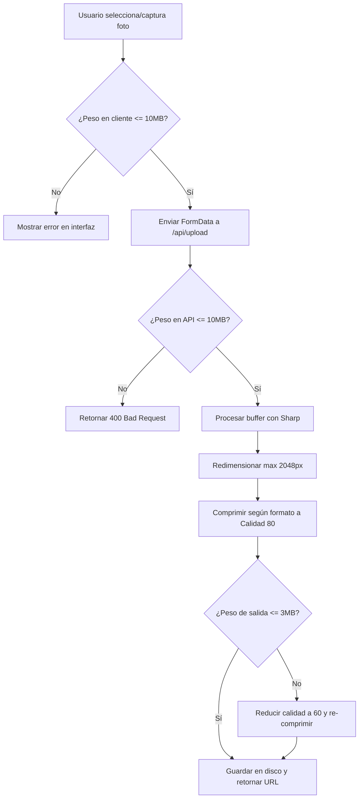

# HU1.1: Compresión de Imágenes en Servidor y Ampliación de Límite de Carga

## 1. Identificador y Título
* **ID:** HU1.1
* **Título:** Compresión de Imágenes en Servidor y Ampliación de Límite de Carga

---

## 2. Historia de Usuario
**Como** desarrollador y administrador del Clóset Digital,  
**Quiero** que el servidor comprima automáticamente las imágenes subidas por los usuarios y eleve el límite máximo de carga a 10 MB,  
**Para** permitir que los usuarios suban fotos de alta resolución tomadas directamente con sus teléfonos modernos (hasta 10 MB) sin fallos de red, al tiempo que optimizamos el almacenamiento en el servidor limitando el tamaño guardado a un máximo de 3 MB por imagen.

---

## 3. Criterios de Aceptación Funcionales
- [ ] **Ampliación de Límite en Servidor:** El endpoint `/api/upload` debe aceptar archivos de hasta 10 MB (anteriormente 5 MB).
- [ ] **Validación y Límite en Interfaz:** La interfaz de usuario debe informar al usuario sobre el límite de 10 MB y validar localmente antes del envío que ningún archivo superar este tamaño.
- [ ] **Compresión Automática en Servidor:** Cada imagen recibida (JPG, PNG o WEBP) de hasta 10 MB debe pasar por un proceso de compresión automática del lado del servidor utilizando la biblioteca `sharp`.
- [ ] **Límite de Almacenamiento Físico (Máx 3 MB):** El tamaño final del archivo guardado en disco (`public/uploads/`) no debe superar los 3 MB. Si una imagen comprimida aún supera los 3 MB, se debe aplicar un algoritmo iterativo de reducción de resolución y calidad hasta garantizar que pese menos de 3 MB.
- [ ] **Preservación de Calidad Visual:** Las imágenes comprimidas deben mantener una calidad visual óptima para catalogar prendas (resolución sugerida máxima de 2048px en su lado más largo, calidad inicial de 80%).

---

## 4. Especificación Técnica y Arquitectura

### A. Biblioteca de Procesamiento de Imágenes
Se utilizará la biblioteca de alto rendimiento **`sharp`** para realizar el procesamiento de imágenes del lado del servidor.

### B. Flujo de Subida y Compresión


### C. Implementación del Endpoint de Carga (`app/api/upload/route.ts`)
* **Límite de entrada:** 10 MB (`10 * 1024 * 1024` bytes).
- El endpoint procesa los archivos mediante `sharp`.
- Identifica el tipo MIME (`image/jpeg`, `image/png`, `image/webp`).
- Redimensiona la imagen para que su dimensión más grande sea como máximo 2048px (manteniendo el aspecto).
- Aplica compresión según el formato:
  - **JPEG/JPG:** `.jpeg({ quality: 80, progressive: true })`
  - **WEBP:** `.webp({ quality: 80 })`
  - **PNG:** `.png({ compressionLevel: 8, palette: true })` (o conversión opcional a Webp/JPEG para optimizar tamaño).
- Si tras la compresión inicial el buffer supera los 3 MB, se reduce la calidad o escala a un máximo de 1600px para garantizar el cumplimiento del límite de almacenamiento.

---

## 5. Especificación UX/UI

### Mensajes Informativos y Validación
* **Mensaje de Ayuda:** En el componente `MultiImageUpload`, se actualizará la etiqueta informativa para que muestre claramente: `"MÁXIMO 4 FOTOS (HASTA 10MB CADA UNA)"`.
* **Alertas de Validación en Cliente:** Si el usuario intenta cargar un archivo que supera los 10 MB, se detendrá el proceso de agregación inmediatamente y se mostrará un mensaje de alerta: `[ERROR] El archivo "[nombre]" excede el tamaño máximo de 10MB.`.

---

## 6. Lógica de Compresión (Código de Referencia)

```typescript
import sharp from 'sharp';

export async function compressImage(buffer: Buffer, mimeType: string): Promise<Buffer> {
  let sharpImg = sharp(buffer);
  const metadata = await sharpImg.metadata();
  
  // 1. Redimensionamiento adaptativo (max 2048px de lado)
  let width = metadata.width;
  let height = metadata.height;
  if (width && height && (width > 2048 || height > 2048)) {
    sharpImg = sharpImg.resize({
      width: 2048,
      height: 2048,
      fit: 'inside',
      withoutEnlargement: true
    });
  }

  // 2. Compresión inicial
  if (mimeType === 'image/png') {
    sharpImg = sharpImg.png({ compressionLevel: 8, palette: true });
  } else if (mimeType === 'image/webp') {
    sharpImg = sharpImg.webp({ quality: 80 });
  } else {
    sharpImg = sharpImg.jpeg({ quality: 80, progressive: true });
  }

  let outputBuffer = await sharpImg.toBuffer();

  // 3. Salvaguarda estricta de 3MB
  const threeMB = 3 * 1024 * 1024;
  if (outputBuffer.length > threeMB) {
    // Si sigue superando los 3MB, re-comprimir a calidad 60 y resolución max 1600px
    sharpImg = sharp(buffer).resize({
      width: 1600,
      height: 1600,
      fit: 'inside',
      withoutEnlargement: true
    });

    if (mimeType === 'image/png') {
      // Para PNG extremadamente pesados, forzamos compresión agresiva o conversión a JPEG
      sharpImg = sharpImg.jpeg({ quality: 70, progressive: true });
    } else if (mimeType === 'image/webp') {
      sharpImg = sharpImg.webp({ quality: 60 });
    } else {
      sharpImg = sharpImg.jpeg({ quality: 60, progressive: true });
    }
    outputBuffer = await sharpImg.toBuffer();
  }

  return outputBuffer;
}
```

---

## 7. Casos de Prueba y QA

### Escenario 1: Carga de archivo entre 5 MB y 10 MB (Caso de Éxito Principal)
* **Acción:** El usuario selecciona una foto de 8.5 MB tomada con la cámara de su móvil de última generación.
* **Proceso:** La interfaz acepta el archivo y permite agregarlo a las vistas previas. Al enviar el formulario, el endpoint `/api/upload` procesa la imagen, aplica la compresión con `sharp` y reduce su peso a aprox. 1.2 MB.
* **Resultado:** El archivo se guarda con éxito en `public/uploads/` y la prenda se registra correctamente.

### Escenario 2: Intento de carga de archivo superior a 10 MB (Edge Case de Rechazo)
* **Acción:** El usuario arrastra un archivo de 12 MB al área de carga.
* **Proceso:** La validación local en `app/prendas/registrar/page.tsx` intercepta el evento.
* **Resultado:** La imagen no se añade a la lista y se muestra una alerta en rojo: `"El archivo [nombre] supera el límite de tamaño permitido (10MB)."`

### Escenario 3: Garantía de Peso Final inferior a 3 MB (Caso Extremo de Compresión)
* **Acción:** Se simula la subida de un archivo muy complejo con texturas densas de 9.9 MB.
* **Proceso:** El servidor procesa la imagen. La compresión inicial resulta en un archivo de 3.2 MB. La lógica detecta que es superior a 3 MB y activa el flujo de compresión secundario.
* **Resultado:** El archivo final guardado pesa 2.1 MB (menor a 3 MB) y mantiene la legibilidad visual de la prenda.
