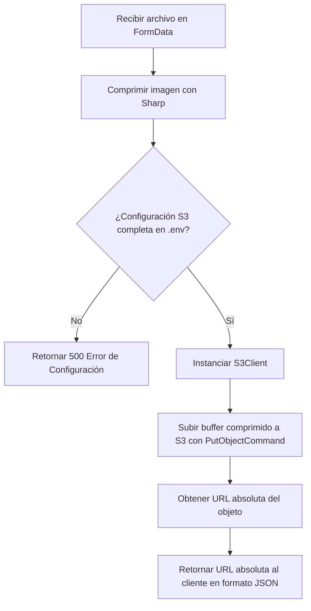

# HU1.2: Almacenamiento de Imágenes en Amazon S3

## 1. Identificador y Título
* **ID:** HU1.2
* **Título:** Almacenamiento de Imágenes en Amazon S3

---

## 2. Historia de Usuario
**Como** desarrollador y administrador del Clóset Digital,  
**Quiero** integrar la carga de imágenes procesadas y comprimidas con el servicio de almacenamiento en la nube Amazon S3,  
**Para** persistir las imágenes en un servidor de almacenamiento en la nube de producción y obtener URLs absolutas válidas que satisfagan el esquema de validación de prendas sin comprometer el almacenamiento del servidor local.

---

## 3. Criterios de Aceptación Funcionales
- [ ] **Almacenamiento en la Nube (Amazon S3):** Reemplazar la escritura local en `/public/uploads/` por la subida de los buffers de imágenes comprimidas (de la HU1.1) a un bucket de AWS S3.
- [ ] **Estructura de Carpetas en S3 (Prefijo "estilos/"):** Las imágenes deben organizarse en S3 utilizando una ruta base llamada `"estilos"`, seguida de una subcarpeta basada en la categoría de la prenda en minúsculas (ej: `estilos/superior/`, `estilos/calzado/`, etc.).
- [ ] **Retorno de URLs Absolutas:** El endpoint `/api/upload` debe retornar URLs absolutas válidas (ej: `https://[bucket-name].s3.[region].amazonaws.com/estilos/[categoria]/[unique-name].[extension]`).
- [ ] **Cumplimiento de Esquema Zod:** Las URLs absolutas devueltas por S3 deben pasar satisfactoriamente la validación de `.url()` del esquema `PrendaZodSchema` en el servidor y cliente.
- [ ] **Asignación Correcta de Metadata en S3:** Cada imagen debe subirse con su respectivo `ContentType` (MIME type: `image/jpeg`, `image/png`, `image/webp`) para asegurar que el navegador la renderice correctamente en lugar de descargarla.
- [ ] **Configuración por Variables de Entorno:** Toda la configuración de AWS (credenciales, región, bucket) debe realizarse a través de variables de entorno seguras. Si falta alguna variable requerida, el endpoint debe responder con un error de configuración del servidor (500).


---

## 4. Especificación Técnica y Arquitectura

### A. Dependencias de AWS
Se utilizará el SDK de AWS oficial para Node.js (v3), específicamente:
* `@aws-sdk/client-s3` (Cliente de S3 para subir archivos y manejar la comunicación).

### B. Flujo de Subida con S3


---

## 5. Variables de Entorno Necesarias
Para configurar el acceso a AWS S3, se deben añadir las siguientes variables de entorno al archivo `.env` en la raíz del proyecto:

```env
# Configuración de AWS S3 para Almacenamiento de Prendas
AWS_ACCESS_KEY_ID=tu_aws_access_key_id
AWS_SECRET_ACCESS_KEY=tu_aws_secret_access_key
AWS_REGION=us-east-1
AWS_BUCKET_NAME=nombre_de_tu_bucket_s3
```

> [!IMPORTANT]
> El bucket de S3 configurado debe tener políticas de acceso que permitan la lectura pública de los objetos subidos (`public-read`), o bien la política del bucket debe permitir la acción `s3:GetObject` de manera pública (`Principal: "*"`) para que las imágenes puedan ser visualizadas por la aplicación.

---

## 6. Lógica de Subida a S3 (Código de Referencia)

```typescript
import { S3Client, PutObjectCommand } from '@aws-sdk/client-s3';

const s3Client = new S3Client({
  region: process.env.AWS_REGION,
  credentials: {
    accessKeyId: process.env.AWS_ACCESS_KEY_ID || '',
    secretAccessKey: process.env.AWS_SECRET_ACCESS_KEY || '',
  },
});

export async function uploadToS3(buffer: Buffer, filename: string, mimeType: string, categoria: string): Promise<string> {
  const bucketName = process.env.AWS_BUCKET_NAME;
  
  if (!bucketName || !process.env.AWS_REGION) {
    throw new Error('Configuración de AWS S3 incompleta en variables de entorno.');
  }

  // Sanitizar y estructurar la ruta con base 'estilos' y subcarpeta por categoría
  const folder = (categoria || 'varios').toLowerCase().trim();
  const key = `estilos/${folder}/${Date.now()}-${filename}`;

  await s3Client.send(
    new PutObjectCommand({
      Bucket: bucketName,
      Key: key,
      Body: buffer,
      ContentType: mimeType,
      // Opcional: ACL: 'public-read' (Dependiendo del bloqueo de acceso público de AWS)
    })
  );

  return `https://${bucketName}.s3.${process.env.AWS_REGION}.amazonaws.com/${key}`;
}
```

---

## 7. Casos de Prueba y QA

### Escenario 1: Carga e Inserción con URLs de S3 (Flujo Exitoso)
* **Acción:** El usuario registra una prenda con sus fotos correspondientes y la categoría "Superior".
* **Proceso:** El servidor procesa, comprime la imagen y la sube a S3 en la ruta `estilos/superior/12345-foto.jpg`. S3 devuelve la URL `https://mi-bucket.s3.us-east-1.amazonaws.com/estilos/superior/12345-foto.jpg`. Esta URL se almacena en la prenda.
* **Resultado:** La Server Action valida la prenda correctamente a través de Zod (sin fallos de validación de URL) y la prenda se guarda con éxito.

### Escenario 2: Intento de subida sin variables de entorno configuradas (Caso de Falla)
* **Acción:** El usuario intenta registrar una prenda cuando las variables de entorno de AWS no están definidas en el servidor.
* **Proceso:** El endpoint `/api/upload` detecta la falta de credenciales.
* **Resultado:** No se escribe ningún archivo local ni remoto, y la API devuelve un código de estado `500 Internal Server Error` con el detalle: `"Error interno en el servidor: Configuración de almacenamiento incompleta."`.
