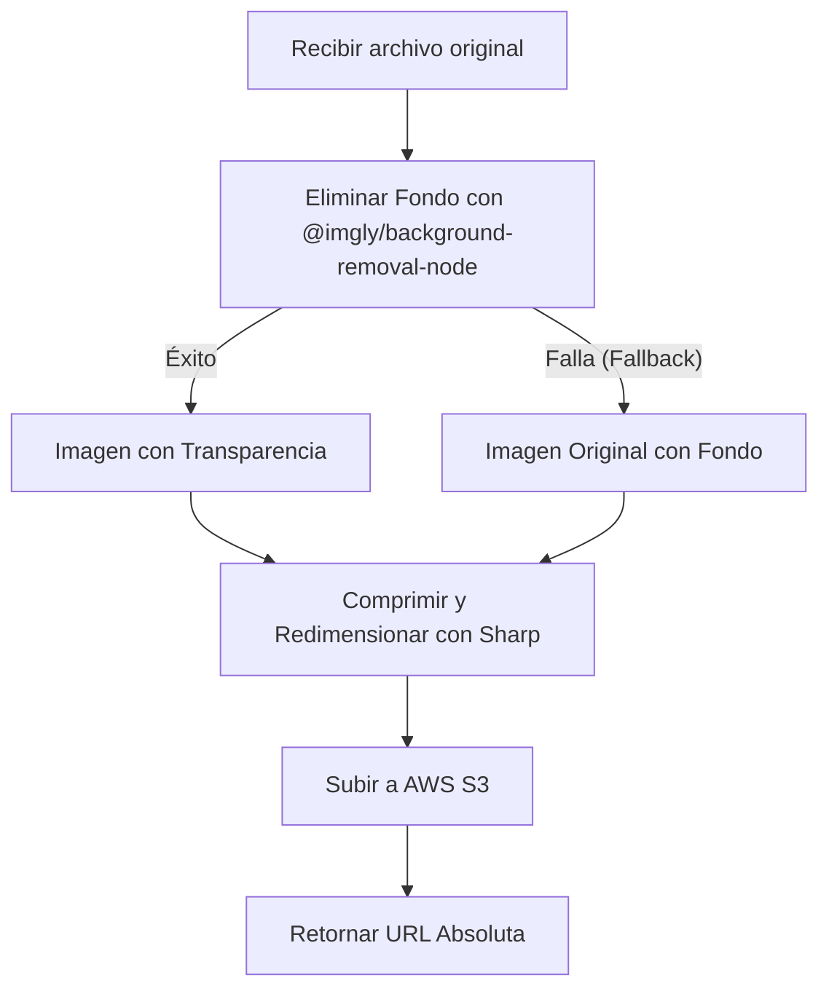

# HU1.3: Eliminación Automática de Fondo en Imágenes de Prendas

## 1. Identificador y Título
* **ID:** HU1.3
* **Título:** Eliminación Automática de Fondo en Imágenes de Prendas

---

## 2. Historia de Usuario
**Como** usuario y administrador del Clóset Digital,  
**Quiero** que el sistema elimine de forma automática el fondo de las fotos que subo de mis prendas, dejando únicamente la prenda con fondo transparente,  
**Para** tener un catálogo visualmente limpio, homogéneo, de aspecto profesional (estilo e-commerce) y sin elementos distractores de mi habitación o closet real.

---

## 3. Criterios de Aceptación Funcionales
- [ ] **Eliminación Automática de Fondo (Servidor):** Cada imagen subida al endpoint `/api/upload` debe ser procesada del lado del servidor utilizando la biblioteca `@imgly/background-removal-node` antes de subirla a AWS S3.
- [ ] **Fondo Transparente:** La imagen de salida resultante debe tener fondo transparente (canal Alpha).
- [ ] **Preservación del Formato con Transparencia:** Para mantener la transparencia del fondo, la imagen procesada se debe guardar e indicar en S3 con un tipo MIME compatible con canal Alpha (`image/png` o `image/webp`).
- [ ] **Secuencia de Procesamiento:** 
  1. Recibir imagen original (hasta 10 MB).
  2. Aplicar eliminación de fondo con `@imgly/background-removal-node`.
  3. Comprimir y redimensionar la imagen transparente resultante con `sharp` (máx. 3 MB y 2048px).
  4. Subir el buffer final a AWS S3.
- [ ] **Manejo de Errores Robustos:** Si el motor de eliminación de fondo falla (por ejemplo, si el modelo ONNX no se puede inicializar o la imagen no es procesable), el sistema debe registrar el error en los logs y subir la imagen original comprimida (con fondo) como fallback para evitar bloquear el registro de la prenda.

---

## 4. Especificación Técnica y Arquitectura

### A. Dependencias Adicionales
Se requiere instalar el módulo nativo de Node.js:
* `@imgly/background-removal-node` (procesamiento local con ONNX y modelos AI pre-entrenados para segmentación de prendas/sujetos).

### B. Secuencia del Pipeline de Imagen (Endpoint `/api/upload`)


---

## 5. Consideraciones de Rendimiento y Memoria

> [!WARNING]
> La biblioteca `@imgly/background-removal-node` ejecuta modelos ONNX de Machine Learning localmente en el servidor. Esto tiene implicaciones que deben considerarse:
> 1. **Primera Petición (Cold Start):** En la primera ejecución, la biblioteca descargará los archivos del modelo (aprox. 70-80 MB) a una caché local en el disco del servidor. Esto puede añadir una latencia de 5 a 15 segundos dependiendo de la conexión a internet.
> 2. **Consumo de Memoria:** El procesamiento ONNX requiere recursos significativos de CPU y memoria RAM. Se sugiere procesar las imágenes de forma secuencial y configurar un tiempo de espera adecuado en el cliente para no generar falsos timeouts.
> 3. **Formato de Salida:** Dado que el resultado requiere transparencia, se recomienda forzar la compresión como `image/png` con paleta reducida o conversión a `image/webp` con compresión con pérdida (quality: 80) conservando la transparencia, optimizando drásticamente el tamaño del archivo final bajo 1 MB.

---

## 6. Lógica de Eliminación de Fondo (Código de Referencia)

```typescript
import { removeBackground } from '@imgly/background-removal-node';

/**
 * Remueve el fondo de una imagen provista en un Buffer y retorna un Buffer transparente.
 * Si el procesamiento falla, retorna el buffer original (mecanismo de fallback).
 */
export async function removeImageBackground(buffer: Buffer): Promise<{ buffer: Buffer; mimeType: string }> {
  try {
    // removeBackground acepta directamente Buffers
    const resultBlob = await removeBackground(buffer);
    
    // Convertir el Blob resultante a Buffer de Node.js
    const resultBuffer = Buffer.from(await resultBlob.arrayBuffer());
    
    return {
      buffer: resultBuffer,
      mimeType: 'image/png' // El resultado nativo es PNG para soportar transparencia
    };
  } catch (error) {
    console.error('Error al remover el fondo de la imagen, usando fallback original:', error);
    // En caso de fallo, devolvemos el buffer original sin procesar
    return {
      buffer,
      mimeType: 'image/jpeg' // Fallback estimado
    };
  }
}
```

---

## 7. Casos de Prueba y QA

### Escenario 1: Subida de prenda y eliminación de fondo exitosa (Flujo Feliz)
* **Acción:** El usuario selecciona una foto de una camiseta en su cama.
* **Proceso:** La imagen de 4 MB se sube a `/api/upload`. El servidor remueve el fondo (dejando solo la camiseta y transparencia), la comprime con `sharp` y la sube a S3 en `estilos/superior/[unique-name].webp`.
* **Resultado:** La imagen en la galería se visualiza sin el fondo de la cama, mostrando únicamente la prenda recortada.

### Escenario 2: Falla del motor de IA / Fallback Activo (Edge Case)
* **Acción:** Se sube un archivo corrupto o el motor ONNX falla al cargar.
* **Proceso:** El try-catch en `removeImageBackground` captura el error.
* **Resultado:** El sistema continúa con la subida de la imagen original comprimida a S3. La prenda se registra con éxito (aunque conserva el fondo original), y no se arroja error 500 al usuario.
