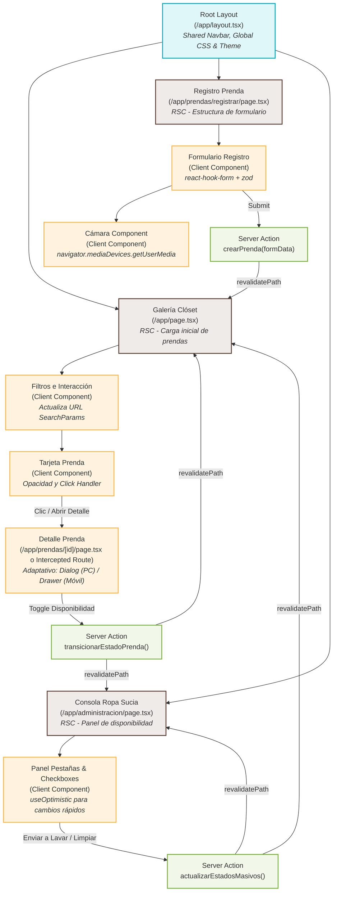

# 3. Flujo de Navegación y Arquitectura de la Información (Next.js App Router)

Este diagrama detalla cómo se organizan las vistas en el **App Router de Next.js**, cómo fluye el usuario entre las diferentes secciones y cómo interactúan las rutas con la sincronización de la URL (`SearchParams`) y los estados interactivos.

---

## 🗺️ Mapa de Arquitectura y Navegación en Mermaid

El siguiente diagrama de flujo detalla la jerarquía de directorios de Next.js, indicando si los componentes se ejecutan en el servidor (**Server Component / RSC**) o en el cliente (**Client Component**), y cómo se relacionan entre sí.

---

## 🚦 Leyenda del Diagrama
* **Root Layout (`layout.tsx`):** Componente estructural de Next.js que envuelve a toda la aplicación. Provee la barra de navegación global (`Navbar`), el pie de página (`Footer`), e inyecta la configuración del tema (Modo Claro/Oscuro).
* **Server Components (RSC):** Renderizados en el servidor para mejorar el SEO y la velocidad de carga de datos directamente desde MongoDB.
* **Client Components (`"use client"`):** Componentes con interactividad, hooks de React (`useState`, `useEffect`, `useOptimistic`), o APIs del navegador (Cámara, MediaRecorder, eventos de tacto en carrusel).
* **Server Actions:** Funciones asíncronas seguras que corren en el servidor y gestionan las mutaciones de base de datos sin requerir endpoints de API REST tradicionales.

---

## 🔗 Estructura de Rutas y Direccionamiento

### 1. `/` (Galería / Dashboard Principal)
* **Propósito:** Mostrar la cuadrícula visual de prendas registradas.
* **Sincronización con URL (SearchParams):**
  - Los filtros de búsqueda no guardan estado en memoria local, sino en la URL (ej. `/?categoria=Superior&colores=Negro&estado=Disponible`).
  - Esto permite copiar la URL y compartir búsquedas exactas, o volver atrás en el historial del navegador de forma natural.
* **Flujo de Navegación:**
  - El usuario puede hacer clic en cualquier tarjeta de prenda para abrir el detalle.
  - Cuenta con un botón de acción flotante (FAB) en móviles o un botón destacado en la barra de navegación para ir a `/prendas/registrar`.

### 2. `/prendas/registrar` (Registro de Ropa)
* **Propósito:** Digitalizar e ingresar una nueva prenda al sistema.
* **Flujo de Navegación:**
  - Al completar exitosamente el registro, la Server Action realiza la mutación e invoca `revalidatePath('/')` y `redirect('/')`, devolviendo al usuario a la pantalla principal con la nueva prenda agregada en el primer lugar del grid.

### 3. `/prendas/[id]` o Intercepted Modals (`/app/@modal/(.)prendas/[id]`)
* **Propósito:** Mostrar el detalle ampliado de una prenda.
* **Técnica Next.js (Intercepted Routes):**
  - Cuando el usuario navega desde la Galería (`/`), Next.js intercepta la ruta y abre el detalle en un modal superpuesto (Dialog/Drawer) sin recargar la página entera y sin perder la posición de scroll de la galería.
  - Si el usuario recarga la página o accede directamente al enlace (`http://dominio.com/prendas/123`), se renderiza como una página independiente de pantalla completa (`/app/prendas/[id]/page.tsx`), garantizando indexabilidad por buscadores y consistencia al compartir enlaces.

### 4. `/administracion` (Consola de Disponibilidad de Ropa)
* **Propósito:** Control operativo rápido del estado de las prendas.
* **Flujo de Navegación:**
  - Accesible desde el menú de navegación principal (`Navbar`).
  - Implementa dos pestañas principales controladas por el componente `Tabs` de shadcn/ui.
  - El usuario puede seleccionar múltiples prendas y transicionar sus estados masivamente, lo cual actualiza la UI de forma optimista e invalida la caché de la galería mediante Server Actions.
