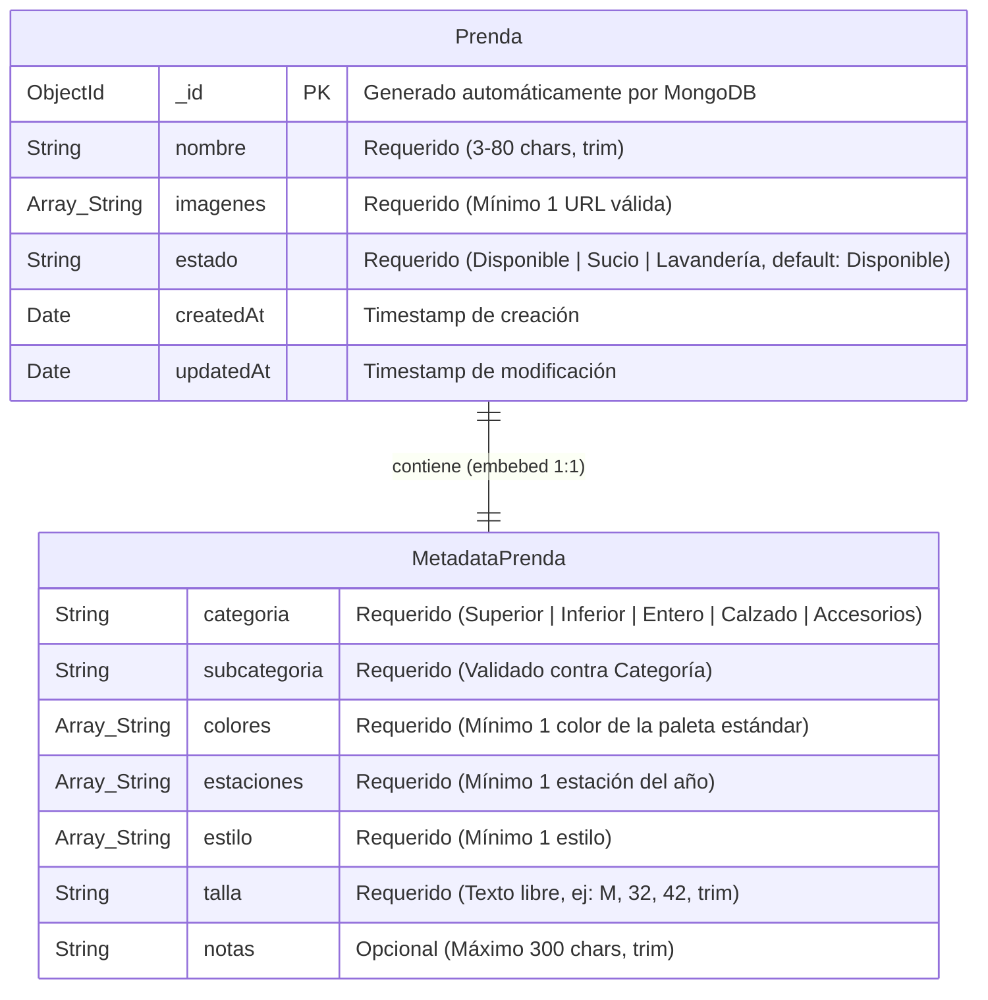

# 1. Diagrama de Modelo de Datos / Entidad-Relación (E-R) Enriquecido

Este diagrama detalla la estructura lógica de los datos almacenados en **MongoDB** para la aplicación **Clóset Digital**. Dado que se utiliza una base de datos NoSQL documental, el modelo de datos se basa en el principio de documentos embebidos (denormalización) para la metadata de la prenda, asegurando lecturas atómicas y de alto rendimiento.

---

## 📊 Diagrama Entidad-Relación (E-R) en Mermaid

El siguiente diagrama detalla la entidad principal `Prenda` y la estructura embebida de `MetadataPrenda`, incluyendo sus tipos de datos, restricciones y validaciones.



---

## ⚙️ Reglas de Validación y Restricciones de Datos

### 1. Entidad `Prenda`
* **`nombre`**: Debe tener entre 3 y 80 caracteres. No se permiten nombres vacíos o formados únicamente por espacios.
* **`imagenes`**: Lista de URLs de almacenamiento en la nube (Cloudinary, AWS S3, etc.). Debe contener al menos una imagen.
* **`estado`**: Campo enumerado con tres estados posibles:
  - `Disponible`
  - `Sucio`
  - `Lavandería`

### 2. Documento Embebido `MetadataPrenda`
* **`categoria` y `subcategoria` (Validación Jerárquica Crucial):**
  La subcategoría elegida debe pertenecer estrictamente al árbol jerárquico de la categoría correspondiente. Si no coincide, la validación de Mongoose y Zod fallará de inmediato.
  ```
  Superior   --> [Camiseta, Camisa, Hoodie, Chamarra, Suéter, Top]
  Inferior   --> [Jeans, Pantalón, Shorts, Cargo, Joggers, Falda]
  Entero     --> [Vestido, Mono, Overol]
  Calzado    --> [Sneakers, Botas, Zapatos Formales, Sandalias]
  Accesorios --> [Gorra, Bufanda, Cinturón, Lentes, Mochila, Bolso]
  ```
* **`colores`**: Lista de colores normalizados basados en la paleta:
  `['Negro', 'Blanco', 'Gris', 'Azul Marino', 'Azul Claro', 'Beige', 'Café', 'Verde Oliva', 'Burdeos', 'Rojo', 'Amarillo', 'Verde', 'Rosa']`
* **`estaciones`**: Lista de estaciones del año permitidas:
  `['Primavera', 'Verano', 'Otoño', 'Invierno', 'Todo el año']`
* **`estilo`**: Lista de estilos/ocasiones aplicables a la prenda:
  `['Casual', 'Formal', 'Deportivo', 'Streetwear', 'Oficina', 'Fiesta']`
* **`talla`**: Cadena de texto requerida para identificar la talla (ej. "S", "M", "L", "32", "US 10").

---

## 💾 Representación en JSON (Documento MongoDB)

Un ejemplo de documento almacenado en la colección `prendas` se visualiza de la siguiente manera:

```json
{
  "_id": { "$oid": "666ba8a1f3c3a9286d9a8c12" },
  "nombre": "Chamarra Denim Oversize",
  "imagenes": [
    "https://res.cloudinary.com/closet-digital/image/upload/v1718306000/chamarra_denim_1.jpg",
    "https://res.cloudinary.com/closet-digital/image/upload/v1718306000/chamarra_denim_2.jpg"
  ],
  "estado": "Disponible",
  "metadata": {
    "categoria": "Superior",
    "subcategoria": "Chamarra",
    "colores": ["Azul Claro"],
    "estaciones": ["Otoño", "Primavera", "Invierno"],
    "estilo": ["Casual", "Streetwear"],
    "talla": "L",
    "notas": "Chamarra de mezclilla gruesa con botones metálicos y forro ligero."
  },
  "createdAt": { "$date": "2026-06-13T19:25:50.000Z" },
  "updatedAt": { "$date": "2026-06-13T19:59:00.000Z" }
}
```
