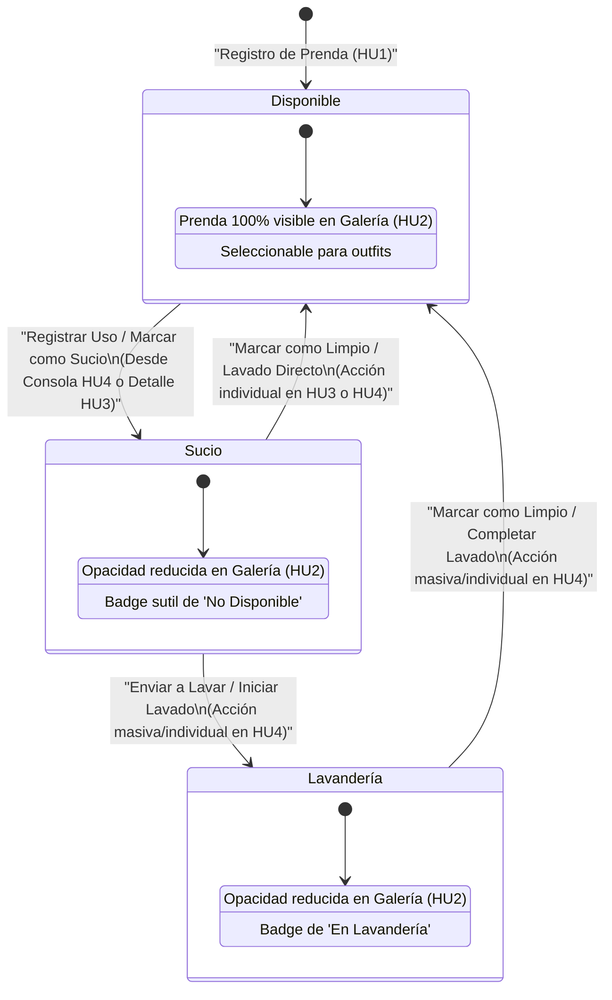

# 2. Diagrama de Transición de Estados (Máquina de Estados de la Prenda)

Este diagrama modela el ciclo de vida operativo de una prenda dentro de la aplicación **Clóset Digital**. La máquina de estados controla la disponibilidad real de la prenda para armar outfits cotidianos y define cómo se actualiza la interfaz visual en respuesta a las acciones del usuario.

---

## 🔄 Diagrama de Transición de Estados en Mermaid

El siguiente diagrama ilustra los tres estados posibles de una prenda, las transiciones permitidas entre ellos, y las acciones del usuario que disparan dichas transiciones.



---

## 📋 Descripción Detallada de Estados

### 1. Estado: `Disponible`
* **Definición:** La prenda está limpia, guardada en el armario físico y lista para ser vestida.
* **Comportamiento en UI:**
  - Se muestra a todo color y con opacidad al 100% en la Galería ([HU2](file:///root/code/estilo/docs/HU2_Vista_Galeria.md)).
  - Es elegible para aparecer en cualquier sugerencia o planificador de outfits.
* **Inicialización:** Es el estado asignado por defecto a cualquier prenda nueva registrada a través de la [HU1](file:///root/code/estilo/docs/HU1_Registro_Prenda.md).

### 2. Estado: `Sucio`
* **Definición:** La prenda ha sido utilizada por el usuario y requiere lavado antes de volver a ser seleccionada.
* **Comportamiento en UI:**
  - Se visualiza con una opacidad reducida (ej. `opacity-40` o `opacity-50` de Tailwind) y un filtro de desaturación opcional (`grayscale` o `desaturate`).
  - Muestra un badge o indicador visual sutil que dice "No disponible" o "Sucio".
  - Se agrupa en la pestaña de **"Ropa en Uso / Sucia"** de la Consola de Administración ([HU4](file:///root/code/estilo/docs/HU4_Gestion_Disponibilidad.md)).

### 3. Estado: `Lavandería`
* **Definición:** La prenda está físicamente en la lavadora, colgada secándose, o en la tintorería externa. No está en el armario pero el proceso de limpieza ya está en marcha.
* **Comportamiento en UI:**
  - Al igual que el estado `Sucio`, se renderiza en la galería con opacidad reducida (`opacity-40`) y un badge que indica "En Lavandería".
  - Se agrupa dentro de la consola de administración ([HU4](file:///root/code/estilo/docs/HU4_Gestion_Disponibilidad.md)) para permitir su retorno masivo al estado `Disponible`.

---

## ⚡ Detalle de Transiciones y Acciones

| Estado Origen | Estado Destino | Acción del Usuario / Trigger | Efecto en Base de Datos | Sincronización en UI |
| :--- | :--- | :--- | :--- | :--- |
| **N/A** | `Disponible` | Crear registro mediante formulario en [HU1](file:///root/code/estilo/docs/HU1_Registro_Prenda.md). | Inserción (`INSERT`) con `estado: 'Disponible'`. | Redirección a la galería y renderizado inmediato. |
| **`Disponible`** | **`Sucio`** | Clic en "Registrar uso hoy" en [HU4](file:///root/code/estilo/docs/HU4_Gestion_Disponibilidad.md) o en el detalle [HU3](file:///root/code/estilo/docs/HU3_Detalle_Prenda.md). | `updateOne` a `estado: 'Sucio'`. | Desvanecimiento visual de la tarjeta en galería. Movimiento a pestaña "Sucia". |
| **`Sucio`** | **`Lavandería`** | Seleccionar prendas sucias y hacer clic en "Enviar a Lavar" en [HU4](file:///root/code/estilo/docs/HU4_Gestion_Disponibilidad.md). | `updateMany` a `estado: 'Lavandería'`. | Actualización de badges de estado. Movimiento dentro de la consola. |
| **`Lavandería`** | **`Disponible`** | Seleccionar prendas en lavandería y hacer clic en "Ya está limpia" en [HU4](file:///root/code/estilo/docs/HU4_Gestion_Disponibilidad.md). | `updateMany` a `estado: 'Disponible'`. | Restauración del color al 100%. Remoción de la consola de sucios. |
| **`Sucio`** | **`Disponible`** | Clic directo en "Ya está limpia" (saltándose paso de lavandería) en [HU3](file:///root/code/estilo/docs/HU3_Detalle_Prenda.md) o [HU4](file:///root/code/estilo/docs/HU4_Gestion_Disponibilidad.md). | `updateOne` a `estado: 'Disponible'`. | Restauración instantánea de opacidad al 100% en galería. |

---

## 💻 Ejemplo de Lógica de Transición en Next.js Server Action

Para asegurar que las transiciones sean seguras, el backend debe validar que el nuevo estado sea uno de los valores del enumerado:

```typescript
// @/app/actions/prenda-actions.ts
'use server';

import connectDB from '@/lib/db';
import Prenda from '@/lib/models/Prenda';
import { EstadoPrenda } from '@/types/prenda';
import { revalidatePath } from 'next/cache';

/**
 * Transiciona el estado de una prenda de vestir validando las reglas de negocio.
 */
export async function transicionarEstadoPrenda(
  prendaId: string, 
  nuevoEstado: EstadoPrenda
) {
  try {
    await connectDB();
    
    // Validar estado permitido
    const estadosPermitidos: EstadoPrenda[] = ['Disponible', 'Sucio', 'Lavandería'];
    if (!estadosPermitidos.includes(nuevoEstado)) {
      return { success: false, error: 'Estado de transición no válido.' };
    }

    const prendaActualizada = await Prenda.findByIdAndUpdate(
      prendaId,
      { estado: nuevoEstado },
      { new: true, runValidators: true }
    );

    if (!prendaActualizada) {
      return { success: false, error: 'La prenda especificada no existe.' };
    }

    // Invalidar caché para reflejar los cambios en la galería y administración
    revalidatePath('/');
    revalidatePath('/administracion');

    return { 
      success: true, 
      prenda: JSON.parse(JSON.stringify(prendaActualizada)) 
    };
  } catch (error: any) {
    console.error('Error al transicionar estado:', error);
    return { success: false, error: error.message || 'Error interno del servidor.' };
  }
}
```
